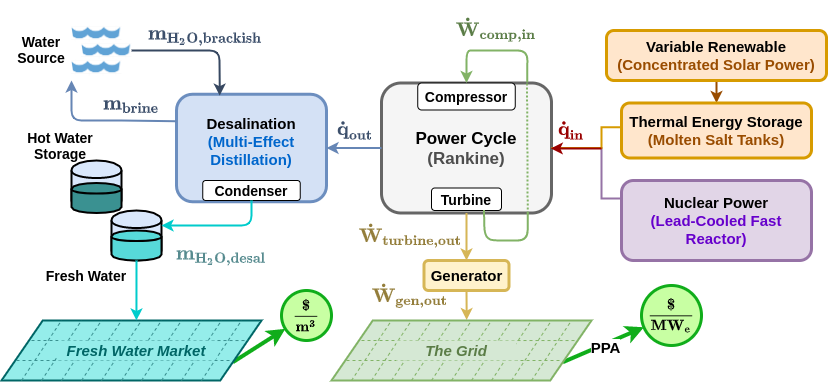

.. NE-2 Simulations documentation master file, created by
   sphinx-quickstart on Tue Jul 27 13:05:15 2021.
   You can adapt this file completely to your liking, but it should at least
   contain the root `toctree` directive.

Welcome to NE-2 Simulations's documentation!
============================================

Integrated Solar & Nuclear Cogeneration of Electricity & Water using the sCO2 Cycle
####################################################################################

Documentation for the NE-2 project's private repository. Currently contains documentation primarily for the *simulations* subproject.

Simulations are conducted using 3 separate codebases:

* **SSC** (SAM Simulation Core) : a C++ library written by NREL used for SAM (System Advisor Model) computations. Repository contains source code for technology and financial models for different energy systems including molten salt power tower plants. `Original Github <https://github.com/NREL/ssc>`_ , `Fork used in this project <https://github.com/gjsoto/ssc>`_
* **Pyomo** : a Python package for creating and solving optimization problems. Package contains solvers for mixed integer linear programming problems. `Documentation <https://pyomo.readthedocs.io/en/stable/>`_
* **Simulations** : a collection of Python class implementations used to orchestrate ``SSC`` and ``pyomo`` computations, respectively. This codebase was created specifically for use in the NE-2 project. `Github <https://github.com/uw-esolab/neup-ies>`_

The ``simulations`` classes call ``pyomo`` directly, but must use certain interfaces to call ``SSC``. These include:

* **PySAM** : creates individual objects in Python with member classes corresponding to different *SSC* input groups. Easy extraction and modification of inputs+outputs through *JSON* scripts or manual changes (therefore easy to break up full simulation into smaller time segments). *Not currently possible to debug through mixed-mode debugging.* `Main Page <https://sam.nrel.gov/software-development-kit-sdk/pysam.html>`_
* **PySSC** : mimics data structures used in the *SSC*. Not super easy to run smaller time segments. *Capable of mixed-mode debugging.*

Finally, we have a overarching system for perturbing individual ``simulations`` runs, running parametric studies for different weather conditions and pricing. 

* **RAVEN** (Risk Analysis Virtual ENvironment) : package written by INL to perform parametric and probabilistic analysis of other complex codes. This is used to create synthetic time histories of available solar resource for the concentrated solar plant. `Project Github <https://github.com/idaholab/raven>`_

Below is a diagram of the full code flow. 

.. image:: _static/NE2_full_codeflow.png
   :target: _static/NE2_full_codeflow.png

**Note** that this only shows interfacing with ``SSC`` through ``PySAM``. The ``PySSC`` interface would replace the middle "Python Module Class" block.
The ``PySSC`` block would look more streamlined: it does not have a time loop, instead calling ``SSC`` directly. It does not have capabilities to call ``pyomo`` optimization. 

Project Guides
============================================

Below are some guides to different aspects of the project.

Guides to Building/Running
########################################

.. toctree::
   :maxdepth: 4
   
   projectsetup
   sscmod
   runningpysam
   runningpyssc

General Project Structure
########################################

.. toctree::
   :maxdepth: 4
   
   highlevelcode
   jsonscripts
   modulecombinations
   sscoverview
   
   
Guides to Model 1a
###################################

Model 1a is the direct TES charging configuration with only LFR heat supply.

.. toctree::
   :maxdepth: 4
   
   nuctesoverview

Guides to Model 2a
###################################

Model 2a is the direct TES charging configuration with LFR and CSP heat supply.

.. toctree::
   :maxdepth: 4
   
   dualplanttesoverview
   directTESoutletMixing
 
 
Guides to Model 1b and 2b
###################################

Model 1b is the **indirect** TES charging configuration with only LFR heat supply.

Model 2b is the **indirect** TES charging configuration with LFR and CSP heat supply.

.. toctree::
   :maxdepth: 4
   
   indirectnuctesoverview
   dualindnuctesoverview
   indirectTESdesignPointMassFlow
   steam2salthx

NE2 Classes and Methods
#################################

.. toctree::
   :maxdepth: 4
   
   simulations

Indices and tables
==================

* :ref:`genindex`
* :ref:`modindex`
* :ref:`search`

