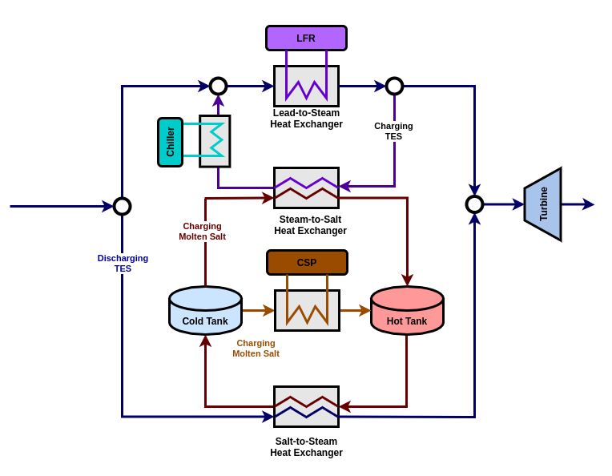

.. NE-2 Simulations documentation master file, created by
   sphinx-quickstart on Tue Jul 27 13:05:15 2021.
   You can adapt this file completely to your liking, but it should at least
   contain the root `toctree` directive.

Welcome to NE-2 Simulations's documentation!
============================================

Integrated Solar & Nuclear Cogeneration of Electricity & Water using the sCO2 Cycle
####################################################################################

Documentation for the NE-2 project's private repository. Currently contains documentation primarily for the *simulations* subproject.

.. image:: _static/NE2_IES_diagram.png
   :target: _static/NE2_IES_diagram.png

Simulations are conducted using 3 separate codebases:

* **SSC** (SAM Simulation Core) : a C++ library written by NREL used for SAM (System Advisor Model) computations. Repository contains source code for technology and financial models for different energy systems including molten salt power tower plants. `Original Github <https://github.com/NREL/ssc>`_ , `Fork used in this project <https://github.com/gjsoto/ssc>`_
* **Pyomo** : a Python package for creating and solving optimization problems. Package contains solvers for mixed integer linear programming problems. `Documentation <https://pyomo.readthedocs.io/en/stable/>`_
* **Simulations** : a collection of Python class implementations used to orchestrate ``SSC`` and ``pyomo`` computations, respectively. This codebase was created specifically for use in the NE-2 project. `Github <https://github.com/uw-esolab/neup-ies>`_

The ``simulations`` classes call ``pyomo`` directly, but must use certain interfaces to call ``SSC``. These include:

* **PySAM** : creates individual objects in Python with member classes corresponding to different *SSC* input groups. Easy extraction and modification of inputs+outputs through *JSON* scripts or manual changes (therefore easy to break up full simulation into smaller time segments). *Not currently possible to debug through mixed-mode debugging.* `Main Page <https://sam.nrel.gov/software-development-kit-sdk/pysam.html>`_
* **PySSC** : mimics data structures used in the *SSC*. Not super easy to run smaller time segments. *Capable of mixed-mode debugging.*

Finally, we have a overarching system for perturbing individual ``simulations`` runs, running parametric studies for different weather conditions and pricing. 

* **RAVEN** (Risk Analysis Virtual ENvironment) : package written by INL to perform parametric and probabilistic analysis of other complex codes. This is used to create synthetic time histories of available solar resource for the concentrated solar plant. `Project Github <https://github.com/idaholab/raven>`_

Below is a diagram of the full code flow. For a more detailed discussion of the code architecture, see :ref:`General Project Structure - Code Overview <highlevelcode>`.

.. image:: _static/NE2_full_codeflow.png
   :target: _static/NE2_full_codeflow.png

**Note** that this only shows interfacing with ``SSC`` through ``PySAM``. The ``PySSC`` interface would replace the middle "Python Module Class" block.
The ``PySSC`` block would look more streamlined: it does not have a time loop, instead calling ``SSC`` directly. It does not have capabilities to call ``pyomo`` optimization. 

Project Guides
============================================

Below are some guides to different aspects of the project.

Guides to Building/Running
########################################

Here are guides to building the project from scratch.
This involves building most of the SAM suite (SSC, WEX, LK, googletest, etc.).
There are certain steps to build the SSC library in two modes: debug and export.
Export mode is the one needed to run PySAM. Debug is used for debugging only. 

.. toctree::
   :maxdepth: 4
   
   projectsetup
   sscmod

There are also quick guides on how to run PySAM or PySSC for any of the available models.
PySAM is used to generate final outputs, PySSC is used for mixed-mode debugging the C++ code from Python.

.. toctree::
   :maxdepth: 4
   
   runningpysam
   runningpyssc

General Project Structure
########################################

Here are some guides and diagrams to help explain the complete code architecture.
This includes explaining the important/modified parts of the SSC code.
This also explains the Python interface (NE2 modules that create PySAM instances, dispatch classes that communicate with Pyomo).

.. toctree::
   :maxdepth: 4
   
   highlevelcode
   jsonscripts
   modulecombinations
   sscoverview
   
   
Guides to Model 1a
###################################

Model 1a is the direct TES charging configuration with only LFR heat supply.

.. image:: _static/model1a_diagram.png
   :target: _static/model1a_diagram.png
   :width: 450px

Here are some guides for Model 1a, or NuclearTES. Included is an overview of the relevant classes used and the class hierarchy.
There is also a guide to all relevant scripts used to run Model 1a, including data generation and data plotting scripts used for the Energies paper.

.. toctree::
   :maxdepth: 4
   
   nuctesoverview
   nuctesscripts

**Relevant neup-ies branches**: `master <https://github.com/uw-esolab/neup-ies>`_, `nuctes <https://github.com/uw-esolab/neup-ies/tree/nuctes>`_ (now part of master), `NE2 tag for energies paper <https://github.com/uw-esolab/neup-ies/releases/tag/energies-model1-paper-final>`_ 

**Relevant ssc branches**: `model2_solvers <https://github.com/gjsoto/ssc/tree/model2_solvers>`_, `SSC tag for energies paper <https://github.com/gjsoto/ssc/releases/tag/energies-model1-paper>`_ (use either to build SSC library)

Guides to Model 2a
###################################

Model 2a is the direct TES charging configuration with LFR and CSP heat supply.

.. image:: _static/model2a_diagram.png
   :target: _static/model2a_diagram.png
   :width: 450px

Here are some guides for Model 2a, or DualPlantTES. Included is an overview of the relevant classes used and the class hierarchy.
There is also a guide to all relevant scripts used to run Model 1a, including data generation and data plotting scripts.
 
.. toctree::
   :maxdepth: 4
   
   dualplanttesoverview
   dualplanttesscripts

Here is a documentation of the calculations done for the LFR and CSP outlet stream mixing before entering the hot tank of the TES. Included are some assumptions made for the calculations and formulas.

   
.. toctree::
   :maxdepth: 4
   
   directTESoutletMixing

There is also a documentation of the current state of Model 2a within this project.

.. toctree::
   :maxdepth: 4
   
   dualplanttesmods
   dualplanttesstatus

**Relevant neup-ies branches**: `master <https://github.com/uw-esolab/neup-ies>`_, `soltes <https://github.com/uw-esolab/neup-ies/tree/soltes>`_ (should be part of master soon)

**Relevant ssc branches**: `model2_solvers <https://github.com/gjsoto/ssc/tree/model2_solvers>`_ (use this to build SSC library)
 
Guides to Model 1b and 2b
###################################

Model 1b is the **indirect** TES charging configuration with only LFR heat supply.

Model 2b is the **indirect** TES charging configuration with LFR and CSP heat supply.

Here are some guides for both indirect charging models: Model 1b (no CSP) and Model 2b or IndirectNuclearTES and DualIndirectTES, respectively. Included is an overview of the relevant classes used and the class hierarchy for both cases.

.. toctree::
   :maxdepth: 4
   
   indirectnuctesoverview
   dualindnuctesoverview
   dualindnuctesscripts

.. note::
	
    There are distinct classes for each model within the NE2 and Dispatch classes. 
	
    In SSC, both Model 1b and Model 2b use the same C++ classes and solvers. The main difference is that in the Model 1b JSON scripts, we set ``q_dot_rec_des`` to 0 to remove CSP.	
	
	
Here are some guides to indirect TES charging model calculations and assumptions. The first guide is explaining how to calculate the new design point mass flows within SSC. The idea is we switch from using specific heat calculations to using enthalpy balance calculations to find heat and mass flows. The second guide is a guide on how to calculate unknown variables within the steam-to-salt heat exchanger

.. toctree::
   :maxdepth: 4
   
   indirectTESdesignPointMassFlow
   steam2salthx
   salt2steamhx

There is also a documentation of the current state of Model 1b and 2b within this project.

.. toctree::
   :maxdepth: 4
   
   dualindnuctesmods
   dualindnuctesstatus

**Relevant neup-ies branches**: `master <https://github.com/uw-esolab/neup-ies>`_, `indtes <https://github.com/uw-esolab/neup-ies/tree/indtes>`_ (should be part of master soon)

**Relevant ssc branches**: `model2b <https://github.com/gjsoto/ssc/tree/model2b>`_ (use this to build SSC library)
 
 
NE2 Classes and Methods
#################################

.. toctree::
   :maxdepth: 4
   
   simulations

Indices and tables
==================

* :ref:`genindex`
* :ref:`modindex`
* :ref:`search`

